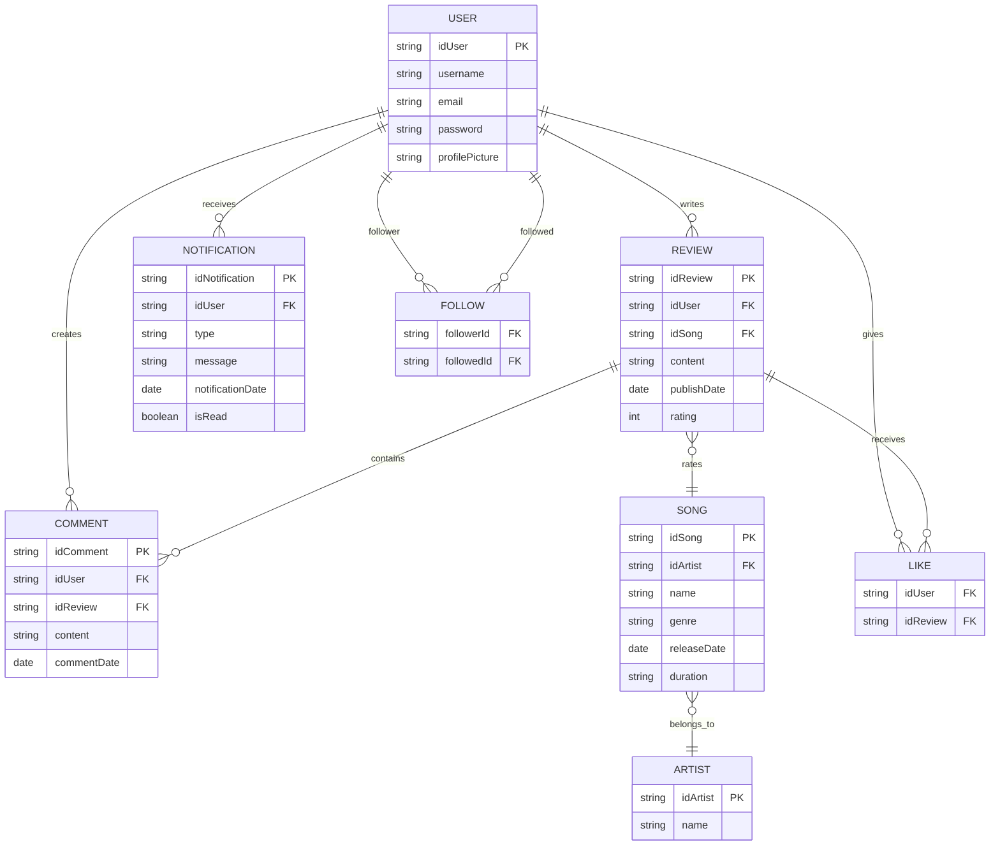
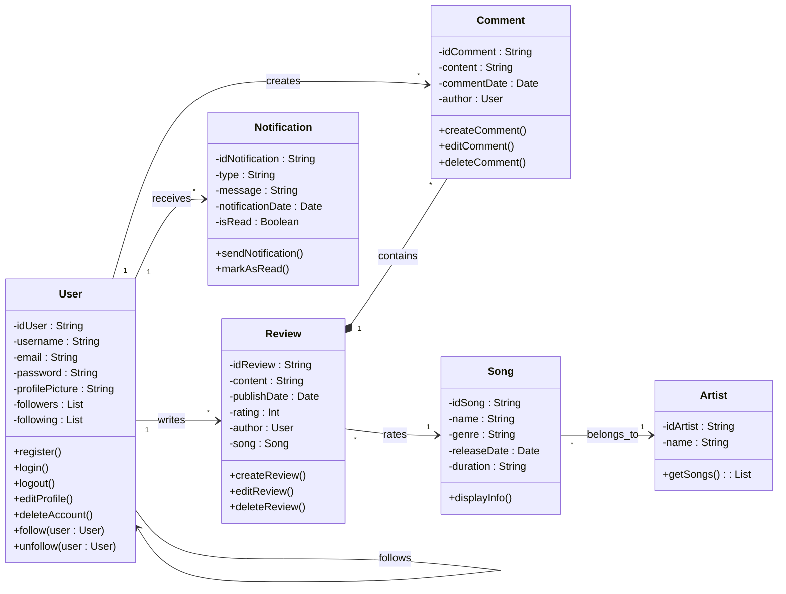

# SOY ( Song Of The Year)

SOY is a mobile social networking application developed as part of a Mobile Computing course. The project focuses on the design and implementation of a music-centered platform that allows users to discover songs, write reviews, and interact with other members of the community.
 
The system includes user registration and authentication, account management, song exploration with rating functionality (0–5 scale), review and comment features, follow/unfollow interactions, and event-based notifications such as new followers, comments, or likes.

## 🚀 Key Features

- Secure user registration and authentication  
- Music exploration with search and genre filtering  
- Rating system (0–5 scale, single editable rating per song)  
- Review and comment management  
- Follow/unfollow social functionality  
- Personalized chronological feed  
- Profile management with review history  
- Event-based notification system  

---

## 🛠 Tech Stack

### Development
- **Kotlin** – Primary programming language  
- **Jetpack Compose** – Declarative Android UI toolkit  
- **Material 3** – Modern Android design system  
- **Android Studio** – Development environment  

### Design
- **Figma** – UI/UX design and prototyping  
  - https://warmth-spool-29052872.figma.site  

---

## 🏗 Architecture & System Modeling

The application structure was designed using formal modeling techniques to ensure clarity and scalability.

### 📊 Entity–Relationship Diagram (ERD)

UML Class Diagram – System design

## 🎨 Design System & Theming

SOY implements a centralized Material 3 dynamic Light and Dark themes for a modern and adaptive Android experience. The theme dynamically adapts to system preferences, ensuring:
- Scalable theming  
- Consistent visual identity  
- Centralized color management  
- Compliance with modern Android UI standards  

### 🎨 Primary Color Palette

| Color Name        | Hex Code  |
|------------------|----------|
| Deep Blue        | #110126  |
| Navy Blue        | #041B61  |
| Royal Blue       | #002CB1  |
| Medium Blue      | #005CC1  |
| Light Blue       | #008BF2  |
| Light Violet     | #9E55FA  |
| Purple           | #AF34DD  |
| Dark Purple      | #8E19B8  |
| Dark Magenta     | #81005C  |
| Burgundy         | #400116  |

---
## 🧩 UI Components

The interface is built using reusable Composable components, promoting modularity and scalability across screens. Custom UI elements and shared components are integrated with Material 3 to maintain design consistency.
